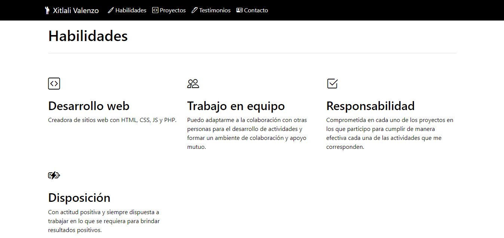

# Mi portafolio de Tecnolochicas PRO

Este portafolio es desarrollado para poner en práctica las habilidades obtenidas dentro del Bootcamp de desarrollo front-end.

Fue desarrollado con HTML, CSS y JS, además del uso del framework Bootstrap utilizando animaciones de bicliotecas externas.

[Proyecto en línea](https://fascinating-salmiakki-a28c09.netlify.app/)

- Capturas de pantalla

- Tecnologías

* HTML
* CSS
* JavaScript
* Bootstrap 5
* Bibliotecas extra: TypewriterJS v2

- Creado por Maria Xitlali Valenzo Serna en el bootcamp de Tecnolochicas Pro